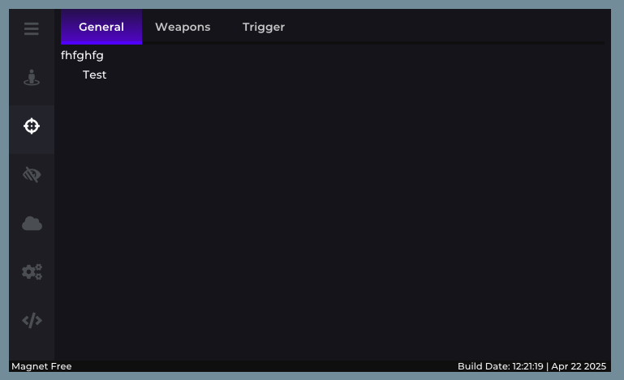
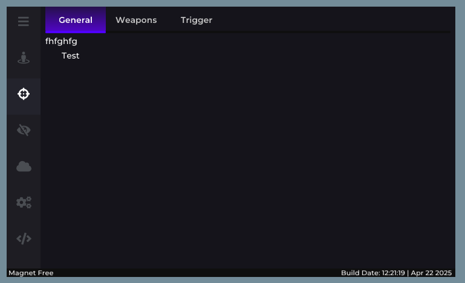
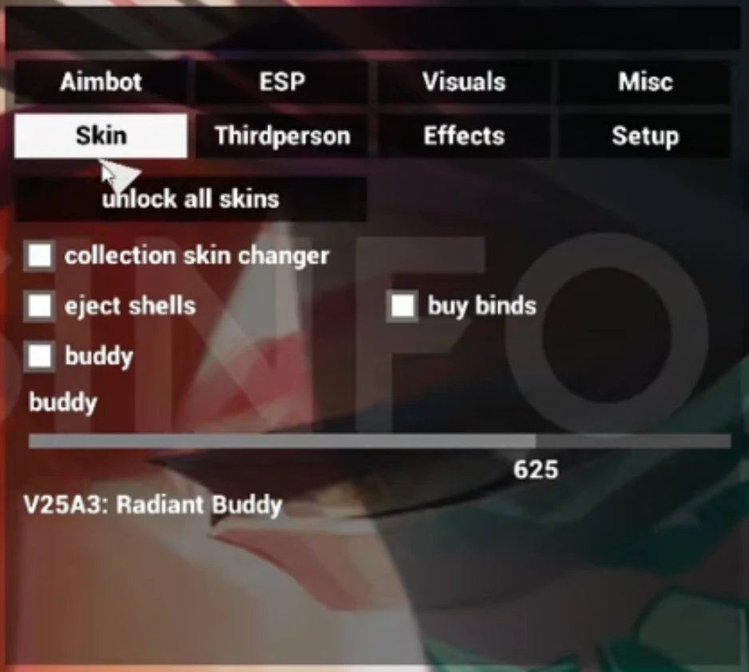
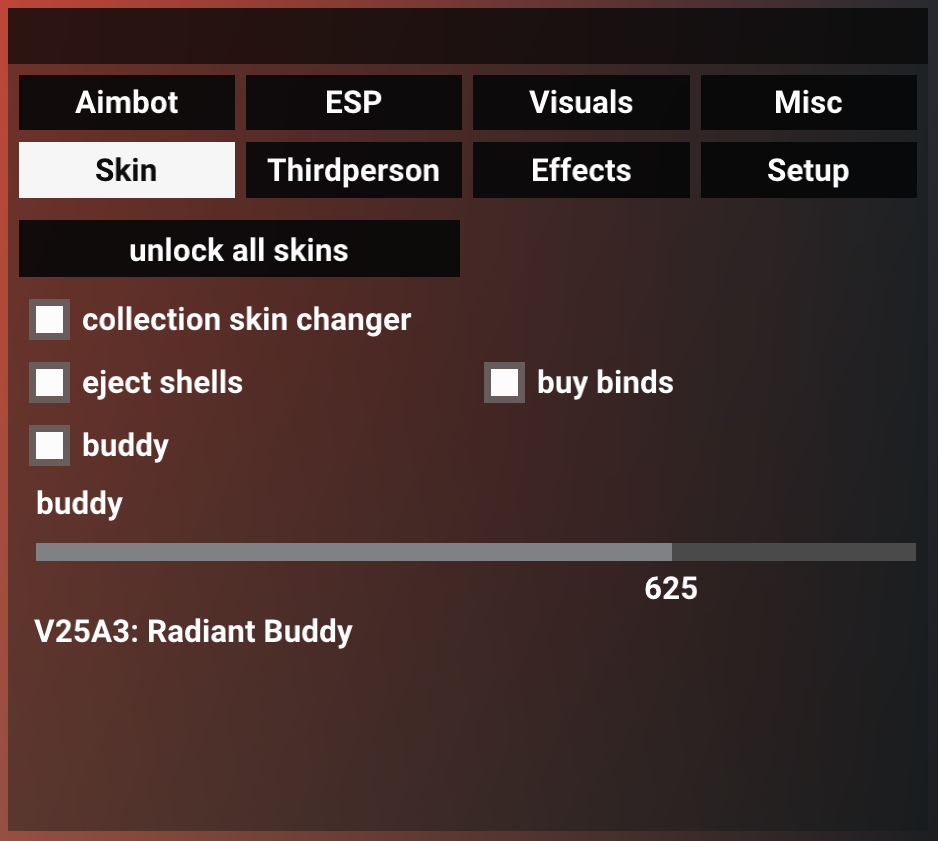

# Impulze - ImGui menu

A Dear ImGui menu whose layout recreates the reference screenshot 1:1 (checked with a pixel diff against it): the icon sidebar, the purple gradient tabs and the footer with the build date. The pages hold a set of custom widgets in the same style.

| Reference | This project |
|---|---|
|  |  |

## Widgets

All in `menu::widgets` (`src/menu/widgets.hpp`). They fill the width of the current panel and return `true` when the value changes:

```cpp
widgets::BeginPanel("General", ImVec2(width, 0));      // rounded panel with a title; 0 = remaining space
widgets::Checkbox("Enabled", &enabled);
widgets::Toggle("Performance mode", &performance);      // switch
widgets::SliderFloat("Speed", &speed, 0.0f, 100.0f, "%.1f");
widgets::SliderInt("Amount", &amount, 0, 10);
widgets::Combo("Mode", &mode, items, IM_ARRAYSIZE(items));
widgets::MultiCombo("Filters", flags, items, IM_ARRAYSIZE(items)); // bool flags[]
widgets::ColorEdit("Accent color", color);              // float color[4], opens a color picker
widgets::Keybind("Menu key", &key);                     // int ImGuiKey, Escape clears it
if (widgets::Button("Reset")) { /* ... */ }
widgets::EndPanel();
ImGui::SameLine(0.0f, 8.0f);                            // next panel on the right
```

See `DrawShowcase()` in `src/menu/menu.cpp` for the example page. Colors and sizes of the widgets are in `src/menu/style.hpp`.

## Tile menu (`src/tilemenu/`)

A second, separate menu that recreates a different reference screenshot 1:1: an empty black title bar, two rows of four black tiles (the selected one is white), and the *Skin* page under them (button, four check boxes, a flat slider with its value and name). The window background is translucent, so whatever is drawn behind it shows through. Sizes, positions and colors were measured from the screenshot and checked against it by aligning the text and boxes (all within 1-2 px; the screenshot itself is a blurry video frame). Font: Roboto Bold, 32 px em.

| Reference | This project (over the demo backdrop) |
|---|---|
|  |  |

It is only the interface: it stores the values of its widgets in `tilemenu::state` and does nothing else. The reference only shows the *Skin* tab, so the other seven tabs are empty pages; give a tab your own page with `tilemenu::pages[tilemenu::Tab_Misc] = &MyPage;` (the function runs inside the menu window, right under the tabs).

```cpp
#include "tilemenu/tilemenu.hpp"

ImGui::CreateContext();
tilemenu::Initialize();   // adds Roboto Bold to the font atlas, BEFORE the first NewFrame; leaves your ImGui style alone

// every frame:
ImGui::NewFrame();
if (ImGui::IsKeyPressed((ImGuiKey)tilemenu::toggle_key, false)) // Insert by default
    tilemenu::open = !tilemenu::open;
tilemenu::Render();       // pushes its own style + font and pops them again
if (tilemenu::state.unlock_all_skins_clicked) { /* true for one frame */ }
ImGui::Render();
```

`tilemenu::state` holds the tab, the four check boxes and `buddy_index` (0..`kBuddyMax`). `tilemenu::buddy_name` can be set to a `const char* (*)(int)` to name the slider values (by default 625 is "V25A3: Radiant Buddy" as in the screenshot). `tilemenu::DrawDemoBackdrop()` only paints a gradient behind the window for the examples.

Copy `src/tilemenu/` into your project and compile `tilemenu.cpp` (Dear ImGui 1.91.9b on the include path). Everything measured lives in the `layout` and `colors` namespaces at the top of `tilemenu.cpp`. Examples: `tilemenu_glfw` (Linux / macOS / Windows) and `tilemenu_dx11` (Windows), built the same way as `menu_glfw` / `menu_dx11` below. The Roboto license (Apache 2.0) is in `src/tilemenu/fonts/LICENSE-Roboto.txt`.

## Adding the Impulze menu to your project

Copy `src/menu/` into your project and compile its four `.cpp` files. Dear ImGui (1.91.9b, vendored in `external/imgui`) must be on the include path. Then:

```cpp
#include "menu/menu.hpp"

ImGui::CreateContext();
menu::Initialize();           // loads the embedded fonts + style, BEFORE the first NewFrame
ImGui_ImplWin32_Init(hwnd);   // your backends as usual
ImGui_ImplDX11_Init(device, context);

// every frame:
ImGui_ImplDX11_NewFrame();
ImGui_ImplWin32_NewFrame();
ImGui::NewFrame();
if (ImGui::IsKeyPressed((ImGuiKey)menu::toggle_key, false)) // Insert by default, can be changed in the menu
    menu::open = !menu::open;
menu::Render();
ImGui::Render();
```

If your project already calls `ImGui::StyleColorsDark()` or adds its own fonts, call `menu::Initialize()` after that; the first font added becomes ImGui's default font, so if you want Montserrat to be the default, call `menu::Initialize()` before adding your own fonts.

## Layout of the code

| File | Contents |
|---|---|
| `src/menu/menu.cpp` | Window layout, sidebar pages, tabs, footer (brand text `kBrand`), and the page contents (`DrawShowcase`, `DrawPlaceholder`, ...) |
| `src/menu/widgets.cpp` | Sidebar button, tab, panel and all the widgets above (with hover/selection animations) |
| `src/menu/style.hpp` | All sizes and colors, measured from the screenshot |
| `src/menu/style.cpp` | `ImGuiStyle` colors, so stock widgets (sliders, combos...) match |
| `src/menu/fonts.cpp` | Embedded fonts: Montserrat Medium/SemiBold and Font Awesome 5 Solid |
| `src/menu/icons.hpp` | Font Awesome codepoints (add any other icon from the FA5 Solid cheatsheet here) |

Pages and tabs are declared in the `kPages` table in `menu.cpp`: icon, name (shown when the sidebar is expanded with the hamburger button), tab names, and a draw function.

## Building the examples

Windows (Visual Studio 2019/2022, DirectX 11):

```
cmake -S . -B build
cmake --build build --config Release
build\Release\menu_dx11.exe
```

Linux / macOS (GLFW + OpenGL 3, needs `libglfw3-dev`):

```
cmake -S . -B build -DCMAKE_BUILD_TYPE=Release
cmake --build build -j
./build/menu_glfw
```

## Fonts

- Montserrat v8.000, SIL Open Font License 1.1 (`src/menu/fonts/LICENSE-Montserrat.txt`), subset to Latin, Latin-1 and Latin Extended-A, so Polish letters work.
- Font Awesome Free 5.15.4 Solid, plus the eye-slash glyph from 5.3.1, which has the older and narrower design seen in the screenshot. Fonts are under SIL OFL 1.1 (`src/menu/fonts/LICENSE-FontAwesome.txt`).

The headers were generated with Dear ImGui's `misc/fonts/binary_to_compressed_c.cpp -u32`.
