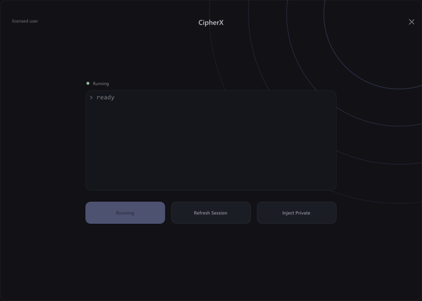

# ImGui menus

Two Dear ImGui menus, each recreating a reference screenshot 1:1 (checked with a pixel diff against it):

- [Impulze](#impulze) (`src/menu/`): icon sidebar, purple gradient tabs, footer, and a set of custom widgets in the same style.
- [CipherX](#cipherx) (`src/cipherx/`): a borderless window with a status line, a console and three buttons.

Both are renderer agnostic and come with a Win32 + DirectX 11 host and a GLFW + OpenGL 3 host.

## Impulze

The layout recreates the reference screenshot 1:1: the icon sidebar, the purple gradient tabs and the footer with the build date. The pages hold a set of custom widgets in the same style.

| Reference | This project |
|---|---|
|  |  |

### Widgets

All in `menu::widgets` (`src/menu/widgets.hpp`). They fill the width of the current panel and return `true` when the value changes:

```cpp
widgets::BeginPanel("General", ImVec2(width, 0));      // rounded panel with a title; 0 = remaining space
widgets::Checkbox("Enabled", &enabled);
widgets::Toggle("Performance mode", &performance);      // switch
widgets::SliderFloat("Speed", &speed, 0.0f, 100.0f, "%.1f");
widgets::SliderInt("Amount", &amount, 0, 10);
widgets::Combo("Mode", &mode, items, IM_ARRAYSIZE(items));
widgets::MultiCombo("Filters", flags, items, IM_ARRAYSIZE(items)); // bool flags[]
widgets::ColorEdit("Accent color", color);              // float color[4], opens a color picker
widgets::Keybind("Menu key", &key);                     // int ImGuiKey, Escape clears it
if (widgets::Button("Reset")) { /* ... */ }
widgets::EndPanel();
ImGui::SameLine(0.0f, 8.0f);                            // next panel on the right
```

See `DrawShowcase()` in `src/menu/menu.cpp` for the example page. Colors and sizes of the widgets are in `src/menu/style.hpp`.

### Adding it to your project

Copy `src/menu/` into your project and compile its four `.cpp` files. Dear ImGui (1.91.9b, vendored in `external/imgui`) must be on the include path. Then:

```cpp
#include "menu/menu.hpp"

ImGui::CreateContext();
menu::Initialize();           // loads the embedded fonts + style, BEFORE the first NewFrame
ImGui_ImplWin32_Init(hwnd);   // your backends as usual
ImGui_ImplDX11_Init(device, context);

// every frame:
ImGui_ImplDX11_NewFrame();
ImGui_ImplWin32_NewFrame();
ImGui::NewFrame();
if (ImGui::IsKeyPressed((ImGuiKey)menu::toggle_key, false)) // Insert by default, can be changed in the menu
    menu::open = !menu::open;
menu::Render();
ImGui::Render();
```

If your project already calls `ImGui::StyleColorsDark()` or adds its own fonts, call `menu::Initialize()` after that; the first font added becomes ImGui's default font, so if you want Montserrat to be the default, call `menu::Initialize()` before adding your own fonts.

### Layout of the code

| File | Contents |
|---|---|
| `src/menu/menu.cpp` | Window layout, sidebar pages, tabs, footer (brand text `kBrand`), and the page contents (`DrawShowcase`, `DrawPlaceholder`, ...) |
| `src/menu/widgets.cpp` | Sidebar button, tab, panel and all the widgets above (with hover/selection animations) |
| `src/menu/style.hpp` | All sizes and colors, measured from the screenshot |
| `src/menu/style.cpp` | `ImGuiStyle` colors, so stock widgets (sliders, combos...) match |
| `src/menu/fonts.cpp` | Embedded fonts: Montserrat Medium/SemiBold and Font Awesome 5 Solid |
| `src/menu/icons.hpp` | Font Awesome codepoints (add any other icon from the FA5 Solid cheatsheet here) |

Pages and tabs are declared in the `kPages` table in `menu.cpp`: icon, name (shown when the sidebar is expanded with the hamburger button), tab names, and a draw function.

## CipherX

An 840x600 window: the rounded border, the rings in the top-right corner, the status line, the console and the buttons match the reference pixel for pixel (at most 2/255 difference outside the text). The text uses the fonts and sizes of the reference: Segoe UI 13 px (buttons), 12 px ("licensed user"), 11.5 px (status), Segoe UI Semibold 18 px (title) and Consolas 15 px (console). On Windows these are loaded from the Windows font folder. On other systems they are replaced by embedded fonts (see [Fonts](#fonts)) with the same sizes and baselines, so the text looks slightly different there; the render below is the Linux build.

| Reference | This project (Linux build) |
|---|---|
|  |  |

### Adding it to your project

Copy `src/cipherx/` into your project and compile `cipherx.cpp` and `fonts.cpp`. Then:

```cpp
#include "cipherx/cipherx.hpp"

ImGui::CreateContext();
cipherx::Initialize();                       // loads the fonts, BEFORE the first NewFrame
cipherx::on_refresh_session = [] { /* ... */ };
cipherx::on_inject_private  = [] { /* ... */ };

// every frame:
ImGui::NewFrame();
cipherx::Render();
ImGui::Render();

// anywhere, from any thread:
cipherx::Log("session %d refreshed", id);    // console line "> session 1 refreshed"
```

| Setting | Meaning |
|---|---|
| `cipherx::running` | Status dot and label. While `true` the first button is the highlighted "Running" (as in the screenshot); otherwise it is "Start" and calls `on_start` |
| `on_start`, `on_refresh_session`, `on_inject_private` | Button callbacks; when not set, the click is only written to the console |
| `cipherx::license_text` | Text in the top-left corner ("licensed user") |
| `cipherx::open` | Set to `false` by the X button |
| `cipherx::position`, `cipherx::movable` | Window position. By default the top bar drags the window. The two hosts set `movable = false` and move their OS window instead, using `cipherx::IsDragArea()` |

The rings are a static snapshot, like in the screenshot.

| File | Contents |
|---|---|
| `src/cipherx/cipherx.cpp` | Window layout: header, rings, status, console (`Log`), buttons |
| `src/cipherx/style.hpp` | All positions, sizes and colors, measured from the screenshot |
| `src/cipherx/fonts.cpp` | Loads Segoe UI / Consolas, or the embedded replacements |
| `src/cipherx_dx11.cpp`, `src/cipherx_glfw.cpp` | Hosts: borderless 840x600 window that is dragged by the top bar and closed by the X |

## Building the examples

Windows (Visual Studio 2019/2022, DirectX 11):

```
cmake -S . -B build
cmake --build build --config Release
build\Release\menu_dx11.exe
build\Release\cipherx_dx11.exe
```

Linux / macOS (GLFW + OpenGL 3, needs `libglfw3-dev`):

```
cmake -S . -B build -DCMAKE_BUILD_TYPE=Release
cmake --build build -j
./build/menu_glfw
./build/cipherx_glfw
```

## Fonts

Impulze:

- Montserrat v8.000, SIL Open Font License 1.1 (`src/menu/fonts/LICENSE-Montserrat.txt`), subset to Latin, Latin-1 and Latin Extended-A, so Polish letters work.
- Font Awesome Free 5.15.4 Solid, plus the eye-slash glyph from 5.3.1, which has the older and narrower design seen in the screenshot. Fonts are under SIL OFL 1.1 (`src/menu/fonts/LICENSE-FontAwesome.txt`).

CipherX (used when Segoe UI / Consolas are not available):

- Selawik Regular and Semibold, Microsoft's open replacement for Segoe UI with the same character widths, SIL OFL 1.1 (`src/cipherx/fonts/LICENSE-Selawik.txt`), built from the sources at github.com/microsoft/Selawik.
- JetBrains Mono Regular v2.211, SIL OFL 1.1 (`src/cipherx/fonts/LICENSE-JetBrainsMono.txt`), subset to Latin, Latin-1 and Latin Extended-A.

At load time both get the vertical metrics (ascender/descender) of the font they replace, so they have the same size and baseline in ImGui.

The headers were generated with Dear ImGui's `misc/fonts/binary_to_compressed_c.cpp -u32`.
